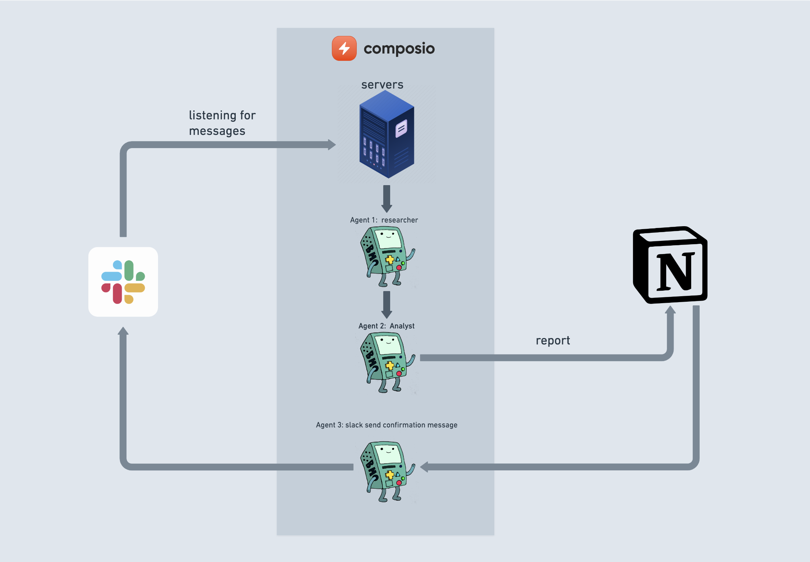

# Building "Useful" Agents with Composio and CrewAI

This is a starter repository for building agents with [Composio](composio.dev) and CrewAI. You can use this codebase to update and build your own dynamic agents.

## Usecase

This is an example for integrating Slack messages, conducting research, generating detailed analyses, and automating report creation in Notion.

## Overview

Project execution follows this workflow:

- Using Composio to get Slack messages. Every time a Slack message is sent, a trigger is raised which is received by Composio and sent to the server.
- On Receiving the trigger, Crewai Agents are initiated
- Using CrewAI to build two agents: one for researching the topic and the second for writing a detailed analysis on the topic.
- Using Composio to write the detailed report in Notion, sending a confirmation message to Slack.

1. CrewAI powers the orchestration of the agents and tools.
2. Composio provides CrewAI the right tools which allows connecting to Slack (Receiving the message, sending a message to channel), Notion (Creating a page)

Here's a visual representation of the workflow:



Below is the basic setup you can do to run the repository.

## Setup

1. **Environment Setup**

   Add a `.env` file and insert your OPENAI_API_KEY and Slack Channel ID.
   For Slack, identify the channel you wish to monitor. Navigate to the channel about section, and scroll to the bottom to locate the Channel ID.

   ```bash
   cp .env.sample .env
   ```

   **Note**: No need to add `TRIGGER_ID` in the `.env` file right now; we'll get to that in the next steps.

2. **Run setup script**

   This script installs necessary dependencies and tools for running the project.

   - Installs Poetry and project dependencies.
   - Installs Ngrok for tunneling.
   - Activates the Poetry shell for managing project dependencies.

   You can run this script to automate the setup process for your development environment.

   NB: Required Python version (>=3.10, <=3.13)

   ```bash
   chmod +x setup.sh && ./setup.sh
   ```

   Setup ngrok for tunneling and set up webhook (Use any method).

   - Using ngrok token
     ```bash
     ngrok config add-authtoken < your auth token >
     ```
   - Local ngrok setup
     ```bash
     ngrok http 2000
     ```

3. **Composio Integration**

   Use Composio CLI to add integrations for Notion and Slack:

   ```bash
   poetry run composio-cli add notion
   poetry run composio-cli add slack
   ```

   Complete the authorization flows for Notion and Slack.

4. **Update the trigger callback URL**

   ```bash
   poetry run composio-cli set global-trigger-callback "<ngrok-url>"
   ```

5. **Enable Slack receive trigger**

   ```bash
   poetry run composio-cli enable-trigger slack_receive_message
   ```

   Update `TRIGGER_ID` in .env

6. **Run the Project**

   To start the AI agents and initiate task execution:

   ```bash
   poetry run python main.py
   ```

   This command initializes the Client Crew, assembling the agents and assigning them tasks according to the configuration.
   By default, it generates a `report.md` file with the output of research on LLMs in the root folder.

   Start sending messages to the Slack channel and see Composio in action, seamlessly updating Notion with detailed reports.

#### Public Server Setup

For public setups, directly set the global trigger callback to the public URL and enable the trigger. To test out locally,
you can use the command `ngrok http PORT`

## Customization

You can modify this repository to create additional agents for various tasks:

1. Modify `main.py` and `src/client/crew.py` for new agents and tasks.
2. Update `src/client/config/agents.yaml` and `src/client/config/tasks.yaml` for new agents and tasks.
3. Adjust any other environment variables as needed.

## Support

For support, questions, or feedback regarding the Composio platform,

- Check out our [Documentation](https://docs.composio.dev)
- Join our [Discord community](https://discord.gg/xwT747R7NE)
